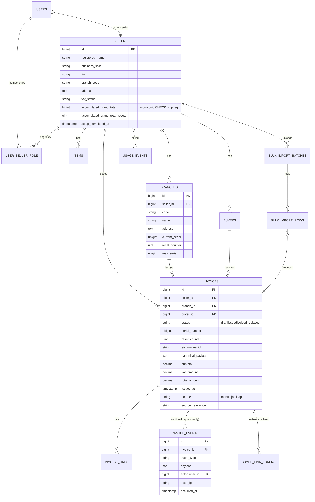

# MDS — Phase 1 Entity Relationship Diagram

## Invariants enforced at the database layer (Postgres only)

| Rule                                                                          | Mechanism                          |
| ----------------------------------------------------------------------------- | ---------------------------------- |
| `(seller_id, branch_id, serial_number, reset_counter)` UNIQUE on `invoices`   | Composite UNIQUE index             |
| `accumulated_grand_total` cannot decrease                                      | `BEFORE UPDATE` trigger            |
| ISSUED invoices must have `serial_number`, `eis_unique_id`, `canonical_payload` | CHECK constraint                   |
| `invoice_events` is append-only                                               | `BEFORE UPDATE/DELETE` triggers    |
| Rows are visible only for the active seller                                   | RLS policies + `mds.current_seller_id` |
